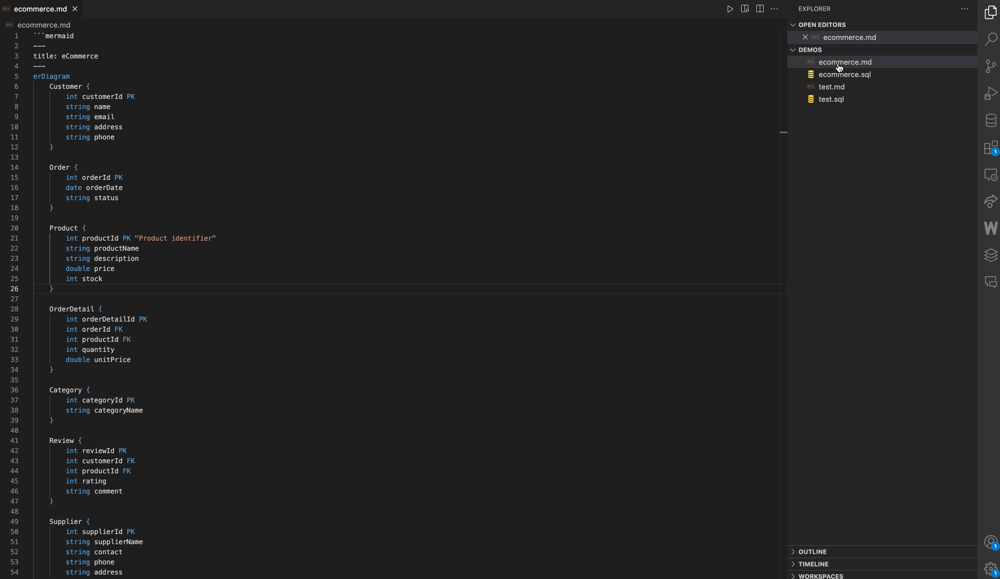

# Mermaid JS ER Diagram to SQL converter

[Mermaid](https://mermaid.js.org/) is Javascript diagramming and charting tool.

This VSCode extension converts [MermaidJS Entity Relationship markdown ](https://mermaid.js.org/syntax/entityRelationshipDiagram.html) to SQL.

.md, .mermaid and .mmd files are currently supported.

---

## Features

> Open a valid Mermaid ER diagram file, search the command palette for "Mermaid ERD to SQL". 
The generated file will be in the same folder as the converted file.

If the basic SQL does not work with your DBMS, you can try the specific Postgres, MySQL or SQLite commands.

---

## Release Notes

The Mermaid markdown for ER diagrams is limited. This extension aims to be a starting point to generate your SQL from what is doable with Mermaid code.

The extension is working for the tests cases in the [demos folder](https://github.com/erralb/mermaid-js-erd-to-sql/tree/master/demos) for MySQL, SQLite and Postgres.

More DBMS support and documentation to come in future releases.

### 1.0.0

Initial release

---

## Issues & Suggestions

Please feel free to open issues and suggest features or pull requests on [Github](https://github.com/erralb/mermaid-js-erd-to-sql)

---

## Recommended extensions

To edit and preview Mermaid mardown files, I personnaly use these extensions :

- [Markdown Preview Enhanced](https://marketplace.visualstudio.com/items?itemName=shd101wyy.markdown-preview-enhanced) or [Markdown Preview Mermaid Support](https://marketplace.visualstudio.com/items?itemName=bierner.markdown-mermaid)
- [Mermaid syntax highlighting](https://marketplace.visualstudio.com/items?itemName=bpruitt-goddard.mermaid-markdown-syntax-highlighting)

---

## Enjoy!
