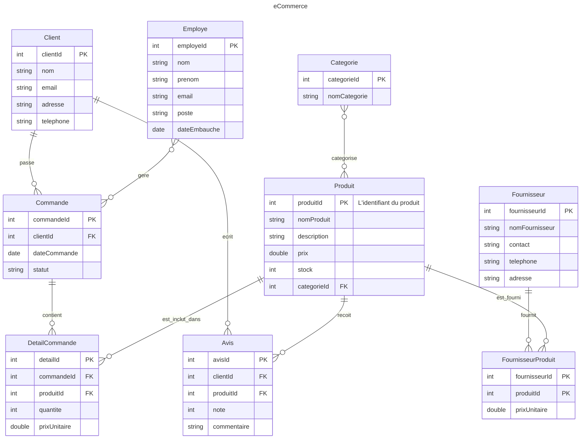

```mermaid
---
title: eCommerce
---
erDiagram
    Client {
        int clientId PK
        string nom
        string email
        string adresse
        string telephone
    }

    Commande {
        int commandeId PK
        int clientId FK
        date dateCommande
        string statut
    }

    DetailCommande {
        int detailId PK
        int commandeId FK
        int produitId FK
        int quantite
        double prixUnitaire
    }

    Produit {
        int produitId PK "L'identifiant du produit"
        string nomProduit
        string description
        double prix
        int stock
        int categorieId FK
    }

    Categorie {
        int categorieId PK
        string nomCategorie
    }

    Avis {
        int avisId PK
        int clientId FK
        int produitId FK
        int note
        string commentaire
    }

    Fournisseur {
        int fournisseurId PK
        string nomFournisseur
        string contact
        string telephone
        string adresse
    }

    FournisseurProduit {
        int fournisseurId PK
        int produitId PK 
        double prixUnitaire
    }

    Employe {
        int employeId PK
        string nom
        string prenom
        string email
        string poste
        date dateEmbauche
    }

    Client ||--o{ Commande : passe
    Commande ||--o{ DetailCommande : contient
    Produit ||--o{ DetailCommande : est_inclut_dans
    Categorie }o--o{ Produit : categorise
    Fournisseur ||--o{ FournisseurProduit : fournit
    Produit ||--o{ FournisseurProduit : est_fourni
    Client ||--o{ Avis : ecrit
    Produit ||--o{ Avis : recoit
    Employe }o--o{ Commande : gere
```
