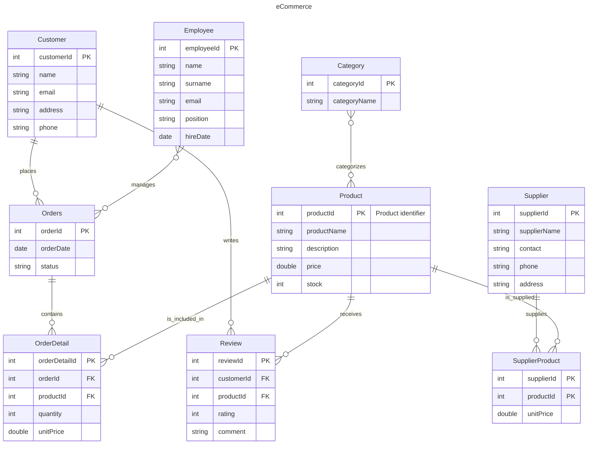

```mermaid
---
title: eCommerce
---
erDiagram
    Customer {
        int customerId PK
        string name
        string email
        string address
        string phone
    }

    Orders {
        int orderId PK
        date orderDate
        string status
    }

    Product {
        int productId PK "Product identifier"
        string productName
        string description
        double price
        int stock
    }

    OrderDetail {
        int orderDetailId PK
        int orderId FK
        int productId FK
        int quantity
        double unitPrice
    }

    Category {
        int categoryId PK
        string categoryName
    }

    Review {
        int reviewId PK
        int customerId FK
        int productId FK
        int rating
        string comment
    }

    Supplier {
        int supplierId PK
        string supplierName
        string contact
        string phone
        string address
    }

    SupplierProduct {
        int supplierId PK
        int productId PK
        double unitPrice
    }

    Employee {
        int employeeId PK
        string name
        string surname
        string email
        string position
        date hireDate
    }

    Customer ||--o{ Orders : places
    Orders ||--o{ OrderDetail : contains
    Product ||--o{ OrderDetail : is_included_in
    Category }o--o{ Product : categorizes
    Supplier ||--o{ SupplierProduct : supplies
    Product ||--o{ SupplierProduct : is_supplied
    Customer ||--o{ Review : writes
    Product ||--o{ Review : receives
    Employee }o--o{ Orders : manages

```