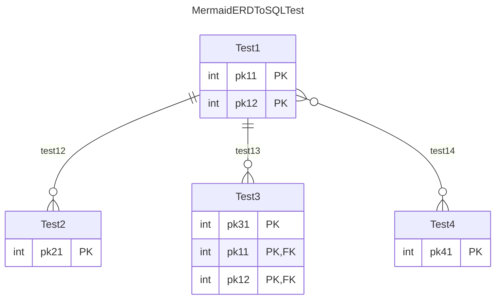

```mermaid
---
title: MermaidERDToSQLTest
---
erDiagram

    Test1 {
        int pk11 PK
        int pk12 PK
    }

    Test2 {
        int pk21 PK
    }

    Test3 {
        int pk31 PK
        int pk11 PK, FK
        int pk12 PK, FK
    }

    Test4 {
        int pk41 PK
    }

    Test1 ||--o{ Test2 : test12
    Test1 ||--o{ Test3 : test13
    Test1 }o--o{ Test4 : test14
    
```
